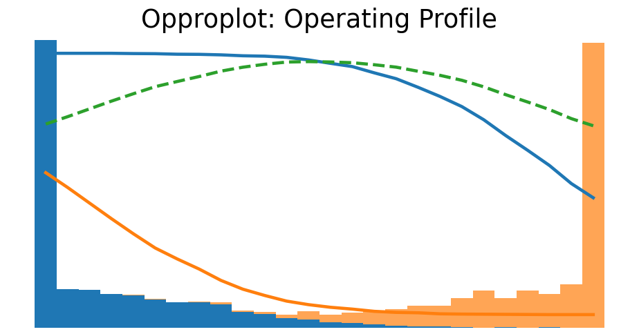
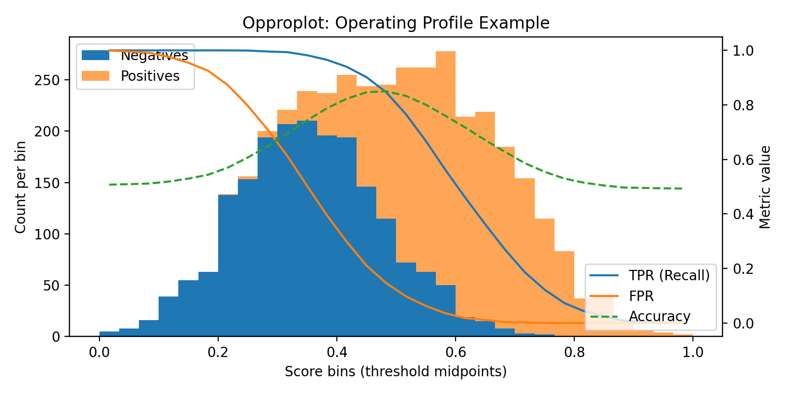

# opproplot

**<u>OP</u>erating <u>PRO</u>file <u>PLOT</u>**

Opproplot is an operating profile plot for binary classifiers: a single figure that shows score distributions by class plus TPR/FPR/Accuracy as you move the decision threshold. It makes threshold selection, ROC/PR intuition, and calibration discussion concrete in one view.

Docs: https://rollingstorms.github.io/opproplot



**What is an Operating Profile Plot?**

An Operating Profile Plot (Opproplot) is a unified visualization for binary classifiers that shows how a model behaves across every possible decision threshold. It combines:
- a stacked histogram of predicted scores for positives vs. negatives
- threshold-dependent performance metrics such as Recall (TPR) and False Positive Rate (FPR)
- computed at the midpoint of each score bin, treating each as a candidate threshold

This creates a complete operating profile of the model in a single view — letting you see where the model is confident, where the classes overlap, and how performance changes as you move the threshold.

It is a compact, multidimensional readout of model behavior: score distribution by class plus operating curves (TPR/FPR/accuracy) on the same axis. Comparing profiles across models or datasets shows whether a model separates classes cleanly, where overlap drives errors, and how threshold choices shift business metrics.

Rather than switching between ROC curves, PR curves, histograms, and calibration plots, Opproplot places the score distribution and the operating characteristics on the same axis, making it easy to:
- identify thresholds with optimal trade-offs
- diagnose where errors occur in score space
- communicate model quality in an interpretable, visual way

**What it is:** Opproplot visualizes the family of decision rules h_t(x) = 1{f(x) >= t} and their induced operating characteristics (TPR, FPR, Accuracy), alongside the empirical score distributions p(s | Y=1) and p(s | Y=0).

**Why it matters:** You see where positives and negatives sit in score space, how recall and false positives trade off at every cutoff, and where accuracy peaks—no context-switching between ROC curves, confusion matrices, and histograms.

**When to use it:** model validation, stakeholder reviews, threshold tuning for production alerting, class-imbalance checks, and calibration audits.

## Installation

From the repo root:

```bash
pip install -e .
```

## Quickstart

```python
import numpy as np
from opproplot import operating_profile_plot

rng = np.random.default_rng(0)
y_true = rng.integers(0, 2, size=5000)
scores = rng.random(size=5000)

fig, ax_hist, ax_metric = operating_profile_plot(y_true, scores, bins=30)
```

The resulting operating profile lets you see where positives and negatives concentrate in score space, how recall and false positive rate trade off as you move the threshold, and where accuracy peaks. It is a single, interpretable view of all possible thresholds for a scoring model.



## Detailed example (scikit-learn)

```python
from sklearn.datasets import load_breast_cancer
from sklearn.model_selection import train_test_split
from sklearn.linear_model import LogisticRegression

data = load_breast_cancer()
X_train, X_test, y_train, y_test = train_test_split(
    data.data, data.target, test_size=0.25, random_state=0, stratify=data.target
)

clf = LogisticRegression(max_iter=1000)
clf.fit(X_train, y_train)

y_score = clf.predict_proba(X_test)[:, 1]
operating_profile_plot(y_test, y_score, bins=30)
```


## Project layout

- Package code lives in `src/opproplot`.
- Tests live in `tests/`.
- Documentation for GitHub Pages lives in `docs/` (see below).
- Regenerate doc images with `python scripts/generate_docs_images.py` (requires numpy, matplotlib, scikit-learn).

## Documentation site

Enable GitHub Pages with the `docs/` folder as the root. The scaffold includes:

- `docs/index.md`: landing page with value proposition and a hero plot.
- `docs/getting_started.md`: install, notebook walkthrough, common models.
- `docs/theory.md`: decision rules, distributions, and metric integrals.
- `docs/examples.md`: real datasets and comparisons.
- `docs/api.md`: core functions and parameters.
- `docs/roadmap.md`: features and status.

Fill in each page as you iterate; the structure is ready to publish.

## Testing

```bash
pytest
```
