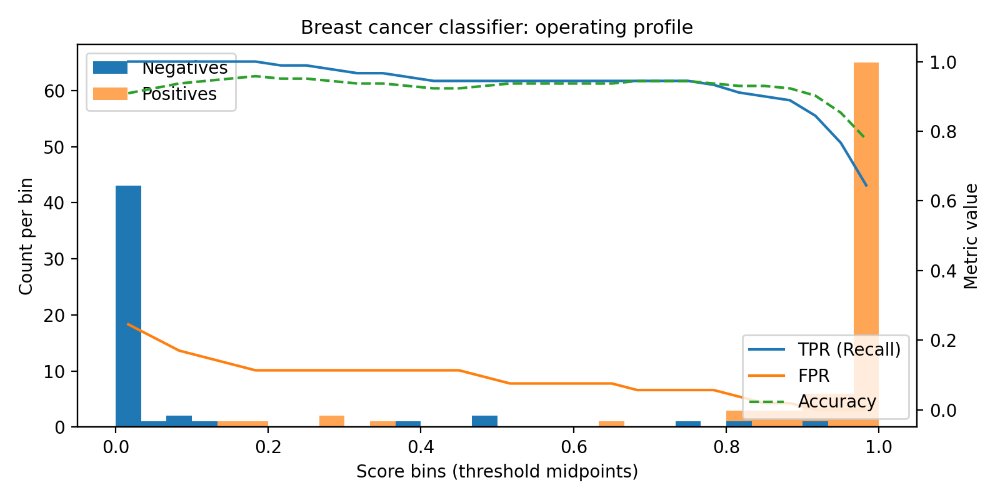

# Opproplot

A compact operating profile plot for binary classifiers: stacked score histograms by class plus TPR/FPR/Accuracy curves at bin-midpoint thresholds. One view to understand every possible cutoff.


## What is an Operating Profile Plot?

An Operating Profile Plot (Opproplot) is a unified visualization for binary classifiers that shows how a model behaves across every possible decision threshold. It combines:
- a stacked histogram of predicted scores for positives vs. negatives
- threshold-dependent performance metrics such as Recall (TPR) and False Positive Rate (FPR)
- computed at the midpoint of each score bin, treating each as a candidate threshold

This creates a complete operating profile of the model in a single view — letting you see where the model is confident, where the classes overlap, and how performance changes as you move the threshold.

Rather than switching between ROC curves, PR curves, histograms, and calibration plots, Opproplot places the score distribution and the operating characteristics on the same axis, making it easy to:
- identify thresholds with optimal trade-offs
- diagnose where errors occur in score space
- communicate model quality visually and quickly

## Why Opproplot

- See score separation between classes directly.
- Trace how recall and false positives move as you slide the threshold.
- Spot the accuracy peak without losing visibility into the distribution.

## Install

```bash
pip install -e .
```

## Quickstart

```python
import numpy as np
from opproplot import operating_profile_plot

rng = np.random.default_rng(0)
y_true = rng.integers(0, 2, size=5000)
scores = rng.random(size=5000)

operating_profile_plot(y_true, scores, bins=30)
```


## Detailed example (scikit-learn)



## Learn more

- [Getting started](getting_started.md): notebook-friendly walkthroughs.
- [Theory](theory.md): decision rules, distributions, and threshold geometry.
- [Examples](examples.md): real datasets and comparisons.
- [API](api.md): function reference and parameters.
- [Roadmap](roadmap.md): upcoming features.
